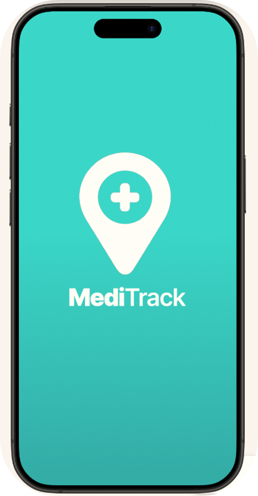
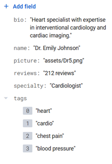

<h1 align="center">MediTrack</h1>
<p align="center">
  
</p>

<details>
<summary>📑 Table of Contents (click to expand)</summary>

- [🩺 Introduction](#-introduction)
- [🎯 App Overview and Objectives](#-app-overview-and-objectives)
  - [👤 1) _For regular users_](#-1-for-regular-users)
  - [🧑‍⚕️ 2) _For medical professionals_](#%EF%B8%8F2-for-medical-professionals)
- [🧭 App Navigation Flow](#app-navigation-flow)
  - [🔐 1) _Sign Up/Log In_](#-1-sign-uplog-in)
  - [🧰 2) _Other Services_](#-2-other-services)
- [🛠️ Technologies Used](#%EF%B8%8F-technologies-used)
  - [1) _Frontend Development_](#1-frontend-development)
  - [2) _Backend Development_](#2-backend-development)
    - [🔧 Technologies Overview](#-technologies-overview)
    - [🔒 User Authentication](#-user-authentication)
    - [🧾 Database Management](#-database-management)
    - [📂 Profile Picture Handling and Storage](#-profile-picture-handling-and-storage)
- [🚀 Getting Started](#-getting-started)
  - [Prerequisites](#prerequisites)
  - [Installation](#installation)
</details>


# 🩺 Introduction
This guide aims at documenting the technologies and techniques employed for the design of MediTrack, a smart healthcare app designed to **connect users to medical services in real-time**, whether they’re looking for a doctor, a pharmacy, or need immediate emergency assistance. Through the focus on the practicality of this app, one can ensure smooth and quick navigation and effective access to all needed medical guidance with emergency cases and pressing medical needs in mind.
A detailed explanation will be provided of the app implementation, from frontend development, all the way through Backend engineering. The tools and methods deployed will also be discussed and illustrated.

# 🎯 App Overview and Objectives
MediTrack is a mobile application, developed for deployment on the Android operating system. 
This app serves the public — including patients, parents, seniors and even travelers — and the professionals who want better visibility and organization. 

Powered by a user-friendly interface and a practical usage workflow, this app’s main features include:
## 👤 1) _For regular users_
- **One-tap emergency access:** users can, without any prior knowledge of the nearest red cross or civil defense stations and their availability or hotlines, dial these services directly and practically through a clear, easy-to-access emergency button that connects them directly to their nearest station. Information about the patient, collected as part of the user’s sign-up process, would be immediately shared with the emergency service for convenience and time saving in dire situations.
- **Live-Map and navigation:** the app provides real-time access to the map, with exclusive display of medical facilities and listing of their respective services, a function that might not be fulfilled on regular maps service providers for medical search convenience. Users can locate nearby facilities -hospitals, emergency centers, specialized care centers-, pharmacies, and healthcare specialists’ private clinics, with real-time filters like “open now”, “available medications”, and “speciality”.
- **Medical Doctor Booking System:** users can filter providers by their specialities, years of experience, and location at their convenience. They are offered various booking methods for their clinical appointments, depending on each healthcare professional’s preference and offered options. Patients are also offered a schedule-visualization feature, where they are allowed to view all bookings made through the app.
- **User profiles:** patients can store medical history, allergies, medications, and emergency contact details – especially useful if unconscious or in crisis.

## 🧑‍⚕️2) _For medical professionals_
-	**Appointment Services:** Doctors can select their preferred methods of booking -regular calls, WhatsApp messaging, email services, MediTrack scheduling services-. They are granted access to the users’ medical profile for fast consultations and recommendations for the situation’s severity does not imply any need for physical appointment.

# App Navigation Flow
## 🔐 1) _Sign Up/Log In_
Below is a detailed pipeline explaining the process of signing or logging in, both for a regular user and a healthcare professional.


❗The process illustrated below can be tested on the emulator, and the app does not offer the option of usage without going through the Log In, SignUp pages and process. This should be implemented at later stages. However, for the current development stage, this will not be deployed. The current demonstration on the emulator is designed to showcase the process for a first-time usage of the app.


## 🧰 2) _Other Services_
As detailed in the flowchart, users are directed to:
-	**“Home Page”** if they register as regular users
-	**“Doctor Profile Page”** if they register as healthcare professionals
All other services, discussed in the “App Overview and Objectives Section” can then be accessed from each of the two pages mentioned above, based on the app user’s identity. Please run the emulator to experiment with the routing and features.

# 🛠️ Technologies Used
This app is intended to be a mobile application to be compatible with the **Android Operating System** exclusively. For that, **Android Studio** was chosen as the tool for development and testing, although native code is yet to be added for the final, fully functional version of the app.

## 1) _Frontend Development_
With the intent to create a natively compiled application for interface between frontend and backend from a single codebase, the **Flutter UI toolkit** was adopted. Its rich component library and **Dart programming language** allowed for the delivery of a responsive and visually consistent experience on the emulator, and in the anticipated deployment stages, on various Android devices. 
 
MediTrack employs the **Provider package**, facilitating efficient app-wide state control.

## 2) _Backend Development_
The following technologies and platforms were adopted for backend engineering:
- ### 🔧 Technologies Overview
  - **Mimimum Android Version Supported:** Android 6.0, Marshmallow Platform (98% of devices in current use)
  - **Target Android Version:** Android 14.0
  - **Android SDK version used for compilation:** 35
 
- ### 🔒 User Authentication
  -	**Platform used for implementation:** Google Firebase and Google Firestore
    
  -	**Authentication methods supported:** email/ password with email-only user verification, Google Sign-In integration (the user can choose to sign in with google using a saved google account on the emulator’s local integrated Gmail application). Healthcare professionals require specialty and license info.
    
  -	**User Role-Based Authentication:**
The app implements a sophisticated role-based access control (RBAC) to manage distinct user journeys. The designed architecture employs a **hierarchical data model** where the registration workflow starts with **Firebase Auth** for core identity management, and **role-based metadata is stored in Cloud Firestore** (NoSQL distributed database) under three collections: 1) users, 2) healthcare_providers and 3) regular_users.

  - **User Role-Based Navigation:**
Navigation is segregated by role (regular user vs. healthcare professional), where routing and **conditional UI rendering** is done based on a _**userRole**_ parameter passed through the app flow.
**Session Management** use JWT tokens from Firebase where role info is embedded in custom claims

- ### 🧾 Database management
  - **Database Operations:** uses batch write operations during registration to ensure data consistency
 
  - **Firestore Collections:**
    1) Regular user credentials and information (information storage not yet implemented): stored in the _**“regular_users”**_ collection
       
    3) Healthcare professionals credentials and required information: stored in the _**“healthcare_providers”**_ collection
       
    5) Doctors information for the “Book an appointment” page: stored in the _**“doctors”**_ collection.
     ❗This collection was created separately from the healthcare_providers collection just for visualization of the “Book and Appointment” page, where a small database needed to be created to allow active search and results display ❗

    7) Verification codes and verification states saved for the authenticated healthcare providers: stored in the _**“verification_codes”**_ collection
       
    9) A _**“users”**_ collection to handle overall users credentials.
   
All fields in these collections will be **automatically** filled when the developer enters them on the Android emulator as seen below. 





- ### 📂 Profile Picture handling and storage:
MediTrack utilizes the ImagePicker plugin to capture and select images from the emulator’s built-in Google “Photos” application, while also implementing custom encoding/decoding mechanisms for image storage optimization. Image URL’s will also be stored in a local database created for that purpose.

# 🚀 Getting Started

## Prerequisites

* **Flutter SDK** (3.0+)
* **Dart SDK** (3.0+)
* **Android Studio** or **VS Code**
* **Android device** or **emulator** (API level 21+)
* **Firebase account** and project setup

## Installation

### 1. Clone the repository

```bash
git clone https://github.com/yourusername/meditrack_new.git
cd meditrack_new
```

### 2. Install dependencies

```bash
flutter pub get
```

### 3. Firebase Configuration

a. Create a Firebase project at [Firebase Console](https://console.firebase.google.com/)

b. Add an Android app to your project with package name: `com.example.meditrack_new`

c. Download `google-services.json` and configure:

```bash
# Copy the template
cp android/app/google-services.json.template android/app/google-services.json

# Replace the template content with your actual Firebase configuration
```

d. Configure Firebase options:

```bash
# Copy the template
cp lib/core/config/firebase_options.dart.template lib/core/firebase_options.dart

# Update with your Firebase project configuration
```

### 4. Run the application

```bash
# For debug build
flutter run

# For release build
flutter run --release
```
